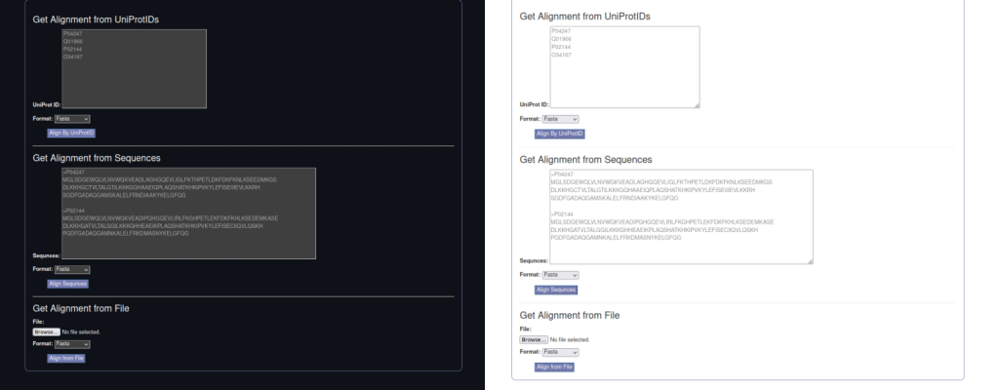
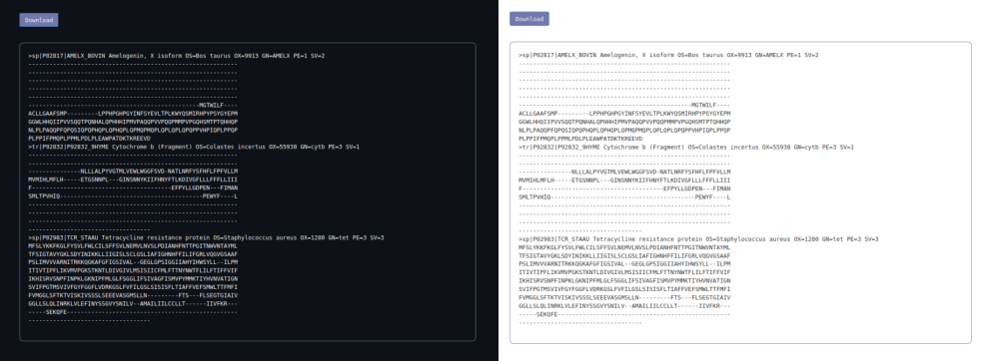

# ClustalW alignment web app

This is a web app that uses clustal to perform MSA. Backgound color is automatically set (ligth/dark) depending on the preference set of the users browser.

It can take as input:
* UNIPROT IDs (uses API to get sequences from uniprot)
* FASTA formated sequences pasted in the text field
* a file containing the FASTA formated sequences



Once the sequences are aligned, the user is promted to a page where he can see the output and download it.



## To run server locally

* Create a conda environment and install the requirements.txt file (note, clustalo uses the conda channel *bioconda*)
* Inside the project folder run:
```
python manage.py runserver
```
